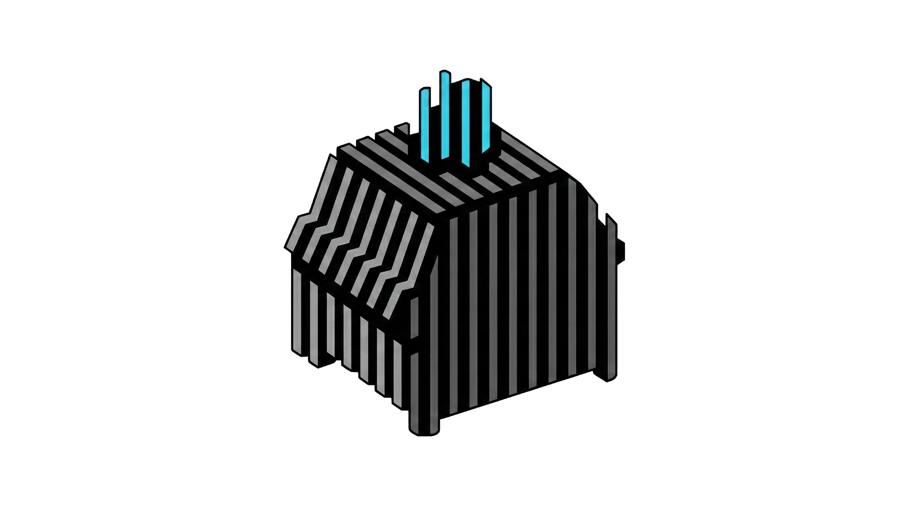

<div align="center">
  
  <h1>Whitespaces</h1>
  <p>A minimalistic, fast, and highly customizable typing test application designed to help you track progress and improve your typing speed.</p>
</div>

---

## ✨ Features

- 🎯 **Minimalistic UI**: A clean, distraction-free interface to keep you focused entirely on typing.
- 🎨 **Deep Customization**: Multiple themes, font choices, and settings to perfectly tailor the typing experience to your preferences.
- ⏱️ **Versatile Typing Modes**: Various configurable testing modes including time-based, word-count based, and custom quotes.
- 📊 **Performance Tracking**: Detailed post-test statistics including WPM (Words Per Minute), accuracy, and consistency.
- 📱 **Fully Responsive**: Works fluidly across different screen sizes, from desktop to mobile.

## 🛠️ Tech Stack

Built with modern web technologies for maximum performance and a smooth developer experience:

- **Frontend**: [SolidJS](https://www.solidjs.com/) + TypeScript for high performance and fine-grained reactivity.
- **Styling**: SCSS and custom CSS architectures for a robust, themeable design system.
- **Build Tool**: Powered by [Vite](https://vitejs.dev/) for an extremely fast development server and optimized production bundles.

## 🚀 Getting Started

### Prerequisites

- [Node.js](https://nodejs.org/) environment
- Recommended: [Bun](https://bun.sh/) package manager

### Local Development

1. **Clone the repository and navigate to the project directory:**
   *(Assuming you already have the code locally)*

2. **Install dependencies:**
   Using `bun`:
   ```bash
   bun install
   ```

3. **Run the development server:**
   ```bash
   bun run dev
   ```
   This will start the hot-reloading local server. Open the provided `localhost` link in your browser to view the app!

4. **Build for production:**
   ```bash
   bun run build
   ```

## 📁 Application Structure

- `/frontend` - Contains all user-facing client code, styles, configurations, and static assets.
- `/backend` - Contains the server-side architecture and APIs.

---

<div align="center">
  <i>Happy Typing! ⌨️</i>
</div>
